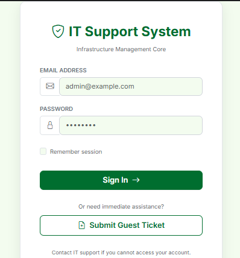
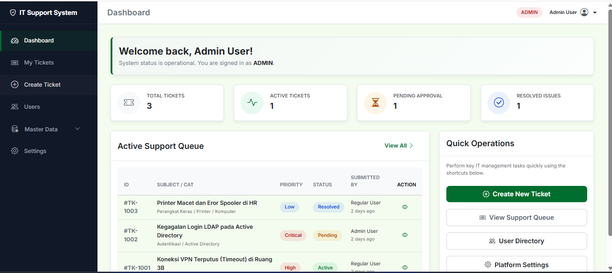
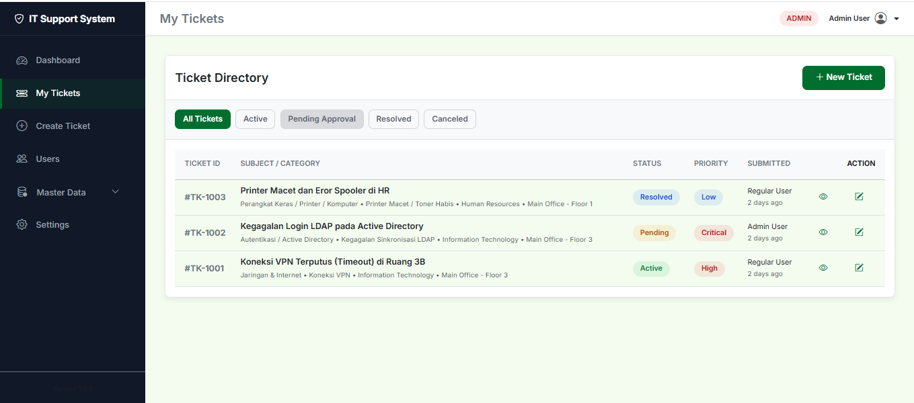
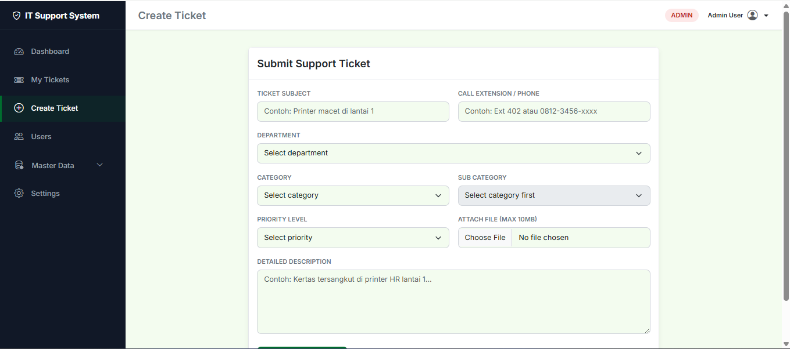
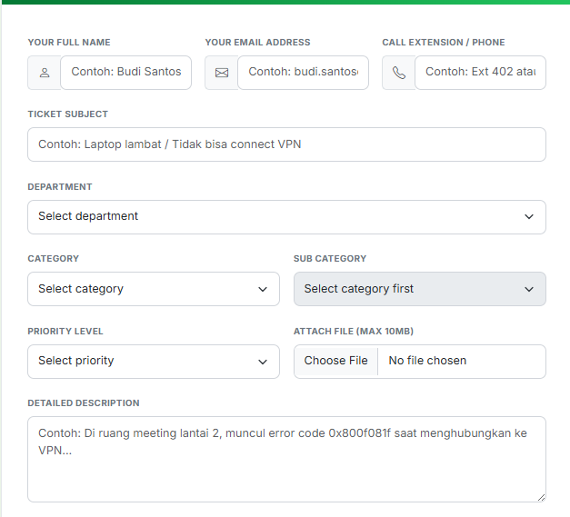
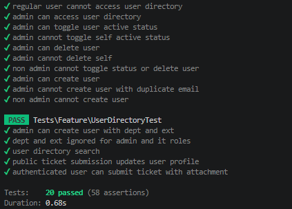
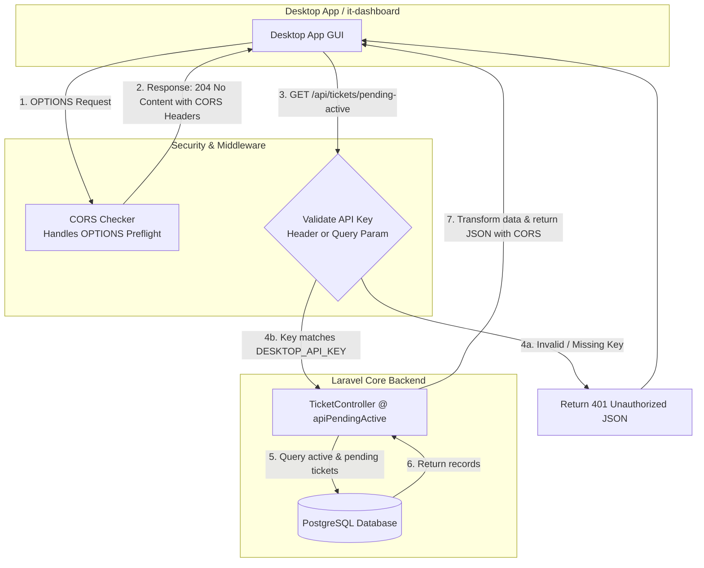

#  IT Support Ticketing Portal

 IT Ticket is a modern, responsive, and secure IT Support Ticketing Application designed to streamline issue reporting and ticketing operations for organizations.

## Tech Stack

The application is structured as a decoupled solution providing both a web portal and secure backend API services:

- **Backend Core / API Engine**:
  - **Framework**: Laravel 12
  - **Language**: PHP 8.2
  - **Database**: PostgreSQL (pgsql)
  - **APIs**: RESTful endpoints with built-in CORS preflight capabilities and header token security.

- **Frontend (Web Portal)**:
  - **Design System**: Vanilla CSS design system following modern brand guidelines.
  - **UI Library**: Bootstrap 5 & Bootstrap Icons for rapid responsive layout.
  - **Asset Compiler**: Vite

- **External Integrations**:
  - **it-dashboard / Desktop App**: An external desktop application that integrates with this core backend via secure REST API endpoints.

---

## Key Features

1. **Role-Based Operational Dashboard**:
   - Dynamic ticketing stats cards (Total, Active, Pending, Resolved) with micro-animations on hover.
   - Clickable statistics cards that redirect and auto-apply filters on the Ticket Directory.
   - Interactive Support Queue table showing the 5 most recent tickets with detail modals accessible directly from the dashboard.
   - Security-enforced role data isolation: regular users (`user`) only see their own tickets, while `admin` and `it` staff see system-wide statistics.

2. **Ticket Management**:
   - **Ticket Directory**: Searchable list with quick client-side filtering by status (All, Active, Pending, Resolved, Canceled).
   - **Detailed Modals**: Pop-up window containing detailed fields (priority, status, categories, sub-categories, department, location, reporter, descriptions, and file attachments).
   - **Public Submission**: Form allowing unauthenticated users to submit issues. The system auto-links the ticket to their email (or registers a new user account if they don't exist).
   - **File Attachments**: Upload and download options for attachments (supporting automatic inline image previews).
   - **Status Actions**: Direct status updates (Active, Pending, Resolved, Canceled) available to authorized staff via the directory dropdown.

3. **User & Identity Directory**:
   - Admin and IT staff can view, search, and register users.
   - Admins can delete users or toggle active/inactive status (protecting self-account modification).

4. **Master Data Administration (Admin Only)**:
   - Complete CRUD interfaces for managing **Departments**, **Locations**, **Categories**, and **Sub-Categories**.
---

## System Screenshots

### 1. Login Page


### 2. Operational Dashboard


### 3. Ticket Directory


### 4. Create Ticket Page


### 5. Guest Ticket Submission Form


### 6. Automated Testing Suite Execution


---

## Installation & Setup

Follow these steps to set up the project locally:

### 1. Prerequisites
Ensure you have PHP 8.2, Composer, Node.js (with NPM), and a PostgreSQL database server installed.

### 2. Clone and Configure
Clone the project repository to your working directory. Then create your `.env` configuration file:
```bash
cp .env.example .env
```

Open `.env` and specify your PostgreSQL database credentials:
```env
DB_CONNECTION=pgsql
DB_HOST=127.0.0.1      # Update with your PostgreSQL Host
DB_PORT=5432           # Default is 5432 (or 5434 in custom environments)
DB_DATABASE=it-ticket
DB_USERNAME=your_username
DB_PASSWORD=your_password
```

### 3. Install Dependencies
Install PHP dependencies via Composer and frontend packages via NPM:
```bash
composer install
npm install
```

### 4. Database Setup
Generate your application key, run database migrations, and seed initial master data and test accounts:
```bash
php artisan key:generate
php artisan migrate --seed
```

### 5. Start the Application
Compile the assets and run the local development server:
```bash
# Compile assets with Vite
npm run dev

# Start Laravel development server
php artisan serve
```

Access the application in your browser at `http://localhost:8000`.

---

## Default User Accounts

Use the following credentials to log in and test different system roles (Password for all accounts is `password`):

| Role | Email | Capabilities |
| :--- | :--- | :--- |
| **Administrator** | `admin@example.com` | Full access, Master Data CRUD, User Directory Management, All Tickets |
| **IT Support** | `it@example.com` | User Directory Management, Ticket Status Updating, All Tickets |
| **Regular User** | `user@example.com` | Submit Tickets, View and filter own tickets/stats only |

---

## Development & Maintenance

### Running Tests
To run the PHPUnit feature and unit test suites:
```bash
php artisan test
```

### Running Seeder Again
If you want to clear and re-populate the database with dummy tickets:
```bash
php artisan db:seed
```

---

## Desktop App & Backend API Integration

The backend serves as the data provider for the external desktop application (**it-dashboard**). Communication is secured via API token verification.

### API Endpoint: Pending & Active Tickets

Retrieves all active and pending tickets from the system in JSON format.

- **Path:** `/api/tickets/pending-active`
- **Supported Methods:** `GET` (fetch data), `OPTIONS` (CORS preflight request)
- **Security Check:** Validates the `X-API-Key` header (or `api_key` query parameter) against the backend `DESKTOP_API_KEY` configuration.
- **Route Declaration:**
  ```php
  // API for Desktop App (Protected by X-API-Key token check in controller)
  Route::match(['get', 'options'], 'api/tickets/pending-active', [\App\Http\Controllers\TicketController::class, 'apiPendingActive'])->name('api.tickets.pending-active');
  ```

#### 1. Request Headers
| Header | Type | Description |
| :--- | :--- | :--- |
| `X-API-Key` | String | The secret key set in `.env` (`DESKTOP_API_KEY`). Default fallback is `default_it_desktop_key_2026`. |
| `Accept` | String | Must be `application/json`. |

#### 2. Query Parameters (Alternative)
| Parameter | Type | Description |
| :--- | :--- | :--- |
| `api_key` | String | Alternative to using the `X-API-Key` header. |

#### 3. Sample Response (200 OK)
```json
{
  "count": 1,
  "tickets": [
    {
      "id": 1,
      "formatted_id": "#TK-1001",
      "title": "Printer Jam in Accounting",
      "description": "The main printer on Floor 2 has a paper jam and error code 0x42.",
      "priority": "medium",
      "status": "pending",
      "call_ext": "Ext 102",
      "created_at": "2026-06-12T09:00:00.000000Z",
      "created_at_humans": "10 minutes ago",
      "reporter": {
        "name": "Jane Doe",
        "email": "jane.doe@example.com"
      },
      "department": "Finance",
      "location": "Floor 2",
      "category": "Hardware",
      "sub_category": "Printer",
      "web_url": "http://localhost:8000/tickets?ticket_id=1"
    }
  ]
}
```

#### 4. Sample Response (401 Unauthorized)
```json
{
  "error": "Unauthorized. Invalid or missing X-API-Key."
}
```

### Ticket Click & Web Redirection Flow

To provide a seamless experience, clicking a ticket in the **it-dashboard** Desktop App opens the corresponding detail view on the Web Portal:

1. **API Provision:** The backend returns a `web_url` for every ticket in the format: `http://localhost:8000/tickets?ticket_id={id}`.
2. **Desktop Action:** When a user clicks a ticket inside the desktop app, the app opens the provided `web_url` in the default system web browser.
3. **Web Portal Auto-Open:** The web directory (`/tickets`) parses the `ticket_id` query parameter on load. If present, the portal's JavaScript automatically triggers and displays the Bootstrap detail modal for that specific ticket (`#ticketModal-{id}`).

---

### Integration Workflow Diagram

The flowchart below outlines how requests from the **it-dashboard** Desktop App are processed by the backend middleware/controller:



